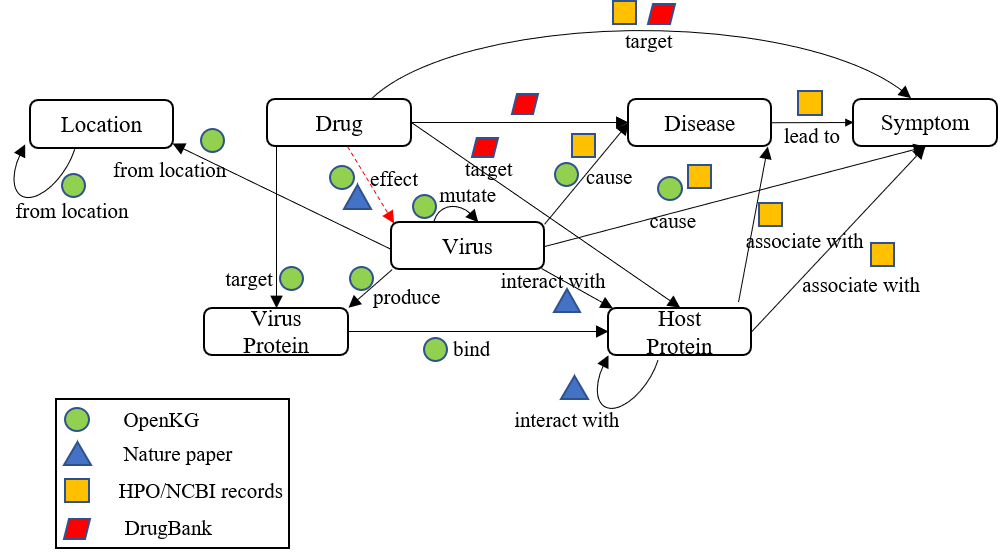

# Covid-19 Knowledge Graph Analysis
The knowledge graph analysis for Covid-19 related data

#### Networks we have:
Two in-house systems of the knowledge graph.
The human protein-protein interactome provided in Github (https://github.com/ChengF-Lab/GPSnet)

What we might do:
Rank the relationship (Nature paper: based on distance)
Discover new relationships (Drug-Drug combination or Drug-Protein)

New repurposing method
Repurposing based on the two in-house networks
Multi-drug effects (Nature paper: can only support pairwise drug combinations)
Confirmation of existing relationship (Based on the nature paper or other literature)
Drug efficiency and side effects (relates to gender, age, etc.)
Add more information to the existing graphs (Candidate nodes: symptoms, treatments, protein domains, virus proteins, and virus protein-related drugs)

#### To-do:
A list of drugs (Drugbank ID) that is related to the COVID-19, as well as side effects (e.g., relates to gender, age, etc.) and see if there is any database available.
Investigate the human protein-protein interactome provided in Github (https://github.com/ChengF-Lab/GPSnet).
Design new motifs based on the available nodes. 

#### problems:
* how to evaluate the drugs discovered:
  * single drug: numeric indicators (z-score, p value),  bioinformatics validation (drug-induced gene signatures and HCoV induced transcriptomics), literature-derived antiviral evidence
  * drug combinations: numeric indicators (z-score, p value)
* data to be released:
  * HCoV–host protein interactions
  * drug–target network
  * human protein–protein interactome

  

